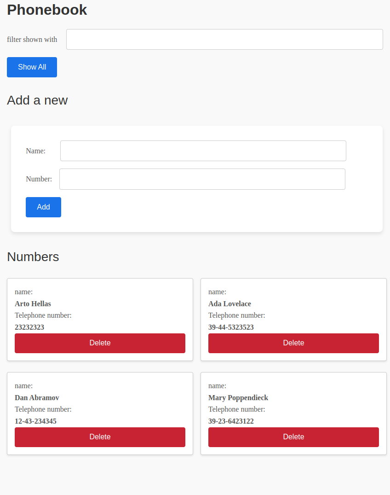

# Phonebook - FullstackOpen Course

Esta es la aplicación **Phonebook** desarrollada para el curso **FullstackOpen**. La aplicación permite gestionar una lista de contactos en la que se pueden agregar, editar y eliminar personas.

## Instalación

1. Clona este repositorio.
2. Instala las dependencias con `npm install`.
3. Inicia la aplicación con `npm start`.

La imagen de la aplicación está almacenada en la carpeta `public`.
